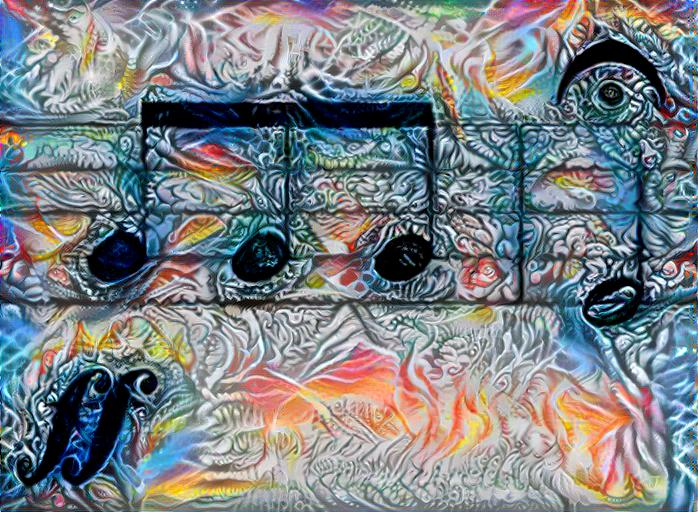
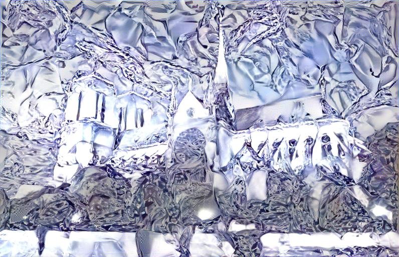
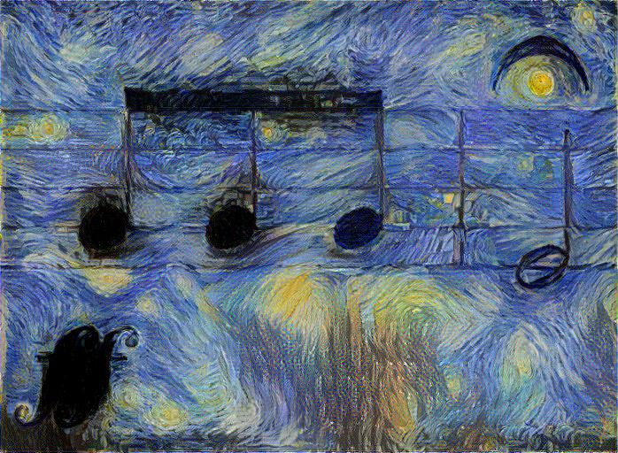

# Exploring Maximum-Mean-Discrepancy-Based Descriptive Neural Image Style Transfer Using PyTorch

## Abstract

Since Gatys et al. proposed an image style transfer algorithm using convolution neural network (CNN) in 2015 ([1.1], [1.2]), many proceeding works extend their method and produce various results. Jing et al ([2]) suggested that these methods be divided into 3 categories: Maximum-Mean-Discrepancy(MMD)-based Descriptive Methods, Markov-Random-Field(MRF)-based Descriptive Methods, and Generative Methods. In this project we focus on MMD-based methods, which achieves style transfer by gradient descent on an output image. We reproduce the result of [1.1], implement the idea "activation shift" in [3] to improve transfering quality, and then give furthur insights into the arguments in [4] by both mathematical proofs and experiments.

## Summary of Gatys et al.'s method

We briefly review the algorithm in [1.1] in order to set up the mathematical notations, which is mainly adapted from [4] and [5], and will be used throughout this project.

Given a content image xc and a style image xs, we would like to generate an output image xo consisting of the content of xc and the style of xs. xo shares the same height and width with xc and is initialized to contain the same pixel values as xc. Let xc, xs, and xo be passed through a pretrained VGG19 CNN ([6]). We denote the heights of feature maps of xc, xs, and xo in layer l of the CNN by hcl, hsl, and hol, respectively, and the widths are denoted by wcl, wsl, and wol. Let mzl = hzl &times; wzl, &forall; z &isin; {c, s, o}. Also let nl be the number of filters in layer l. We then denote the rearranged feature maps of xc, xs, and xo in layer l by matrices Pl &isin; Mnl&times;mcl, Sl &isin; Mnl&times;msl, and Fl &isin; Mnl&times;mol, respectively. Pli,(wcl&times;k+q), 0 &le; k < hcl and 0 &le; q < wcl, is the value of (k+1)-th row and (q+1)-th column of i-th feature map of xc in layer l. Sl and Fl are viewed similarly. We minimize the loss function L = Lc + Ls to achieve style transfer by back propagation through CNN and gradient descent on xo, where  
Lc = &Sigma;l al&frasl;nlmcl &Sigma;i=1nl &Sigma;k=1mcl (Flik - Plik)2 is the content loss, and  
Ls = &Sigma;l bl&frasl;(nl)2 &Sigma;i=1nl &Sigma;j=1nl (Glij - Alij)2 is the style loss, where  
Al = 1&frasl;msl(Sl)(Sl)T and Gl = 1&frasl;mol(Fl)(Fl)T are averaged Gramian matrices, and  
al and bl are user-specified weights.

In the context below, we omit the superscript l when not needed.

The meaning of Gramian matrices is clearly pointed out in [7], section 1: Aij = 1&frasl;ms &Sigma;k=1ms SikSjk indicates how often the i-th and j-th features appears together. G is understood similarly.

The content loss takes care of "where" a feature appears in a feature map. On the other hand, the style loss emphasizes "how often" distinct features appear together but does not care "where" this happens.

### Remarks

1. Though [1.1] assumes that the heights and weights of xc and xs are identical, they are allowed to differ. There is no such requirement in [5].
2. In literature, Gramian matrix comes in two forms: A = SST (others) and A = STS ([5]). The former is more consistent with APIs of deep learning libraries while the latter is the standard form ([10]). We use the former one.

## Images

In this project we use 3 content images and 3 style images as inputs and get 3 &times; 3 = 9 output images in each experiment.

### Content images ([C.1][C.2][C.3])

  

### Style images ([S.1][S.2][S.3])

  

## Part 0: Reproduce Gatys et al.'s results

Gatys kindly provides his implementation of [1.1] on [9]. **All the extensions below are built upon Gatys' code.**

In this part, we simply run Gatys' code to reproduce results in [1.1]. It can be observed that there is "ghosting" in some results, as stated in [8].

  
  
  

## Part 1: Remove ghosting using activation shift

Risser et al. argue that ghosting occurs because there are multiple sets of pixel values that can produce alike feature maps when passed through CNN and some of the sets looks like ghosting ([8]). Novak et al. give related argument in [3], section 3.3 and suggest that using "activation shift" can reduce the ambiguity of candidate sets of pixel values. Their modification is that: instead of letting  
A = 1&frasl;msSST and G = 1&frasl;moFFT,  
let  
A = 1&frasl;ms(S + sU)(S + sU)T and G = 1&frasl;mo(F + sU)(F + sU)T, where  
s is a scalar and U the all one matrix (with size varying to match the need).

The explanation of this modification is provided in [3], which we are not going to restate here. Here we simply implement it and examine its performance with s varying. It can be ovserved that the ghosting disappears with |s| increasing. **Activation shift removes ghosting.**

### Gramian matrix with activation shift. Value of s from top to down: -600, -500, -400, -300, -200, -100, 0, 100, 200, 300, 400, 500, 600.

          
          
          
          
          
          
          
          
          
          
          
          
        

## Part 2: On theoretical part of [4]

Li et al. and Risser et al. regard each column A.k of A and G.k of G as generated from "style" probability distributions Ds and Do, respectively ([4][8]). Minimizing the Gramian-matrix-based style loss Ls is a way to match Do to Ds.

Li et al. furthur argues that minimizing Ls can be interpreted as minimizing MMD with a quadratic kernel. We slightly modify their proof and present it here.

1&frasl;n2 &Sigma;i=1n &Sigma;j=1n (Gij - Aij)2  
\= 1&frasl;n2 &Sigma;i=1n &Sigma;j=1n ((1&frasl;moFFT)ij - (1&frasl;msSST)ij)2  
\= 1&frasl;n2 &Sigma;i=1n &Sigma;j=1n ((1&frasl;mo &Sigma;k=1mo FikFjk) - (1&frasl;ms &Sigma;k=1ms SikSjk))2  
\= 1&frasl;n2 &Sigma;i=1n &Sigma;j=1n ((1&frasl;mo &Sigma;k=1mo FikFjk)2 + (1&frasl;ms &Sigma;k=1ms SikSjk)2 - 2(1&frasl;mo &Sigma;k=1mo FikFjk)(1&frasl;ms &Sigma;k=1ms SikSjk))  
\= 1&frasl;n2 &Sigma;i=1n &Sigma;j=1n ((1&frasl;mo2 &Sigma;k1=1mo &Sigma;k2=1mo Fik1Fjk1Fik2Fjk2) + (1&frasl;ms2 &Sigma;k1=1ms &Sigma;k2=1ms Sik1Sjk1Sik2Sjk2) - (2&frasl;moms &Sigma;k1=1mo &Sigma;k2=1ms Fik1Fjk1Sik2Sjk2))  
\= (1&frasl;mo2 &Sigma;k1=1mo &Sigma;k2=1mo 1&frasl;n2 &Sigma;i=1n &Sigma;j=1n Fik1Fjk1Fik2Fjk2) + (1&frasl;ms2 &Sigma;k1=1ms &Sigma;k2=1ms 1&frasl;n2 &Sigma;i=1n &Sigma;j=1n Sik1Sjk1Sik2Sjk2) - (2&frasl;moms &Sigma;k1=1mo &Sigma;k2=1ms 1&frasl;n2 &Sigma;i=1n &Sigma;j=1n Fik1Fjk1Sik2Sjk2)  
\= (1&frasl;mo2 &Sigma;k1=1mo &Sigma;k2=1mo (1&frasl;n &Sigma;i=1n Fik1Fik2)2) + (1&frasl;ms2 &Sigma;k1=1ms &Sigma;k2=1ms (1&frasl;n &Sigma;i=1n Sik1Sik2)2) - (2&frasl;moms &Sigma;k1=1mo &Sigma;k2=1ms (1&frasl;n &Sigma;i=1n Fik1Sik2)2)  
\= (1&frasl;mo2 &Sigma;k1=1mo &Sigma;k2=1mo (1&frasl;n F.k1TF.k2)2) + (1&frasl;ms2 &Sigma;k1=1ms &Sigma;k2=1ms (1&frasl;n S.k1TS.k2)2) - (2&frasl;moms &Sigma;k1=1mo &Sigma;k2=1ms (1&frasl;n F.k1TS.k2)2)  
\= (1&frasl;mo2 &Sigma;k1=1mo &Sigma;k2=1mo K(F.k1, F.k2, 2)) + (1&frasl;ms2 &Sigma;k1=1ms &Sigma;k2=1ms K(S.k1, S.k2, 2)) - (2&frasl;moms &Sigma;k1=1mo &Sigma;k2=1ms K(F.k1, S.k2, 2)) -------- (1), where  
K(v, u, p) = (1&frasl;nvTu)p is the averaged power kernel.

Theoretically we can use any positive number as the power p of the kernel, but in practice, we need to compute STS and FTF in order to computing MMD, which are of size ms2 and mo2 and will exhausts memory. Thus, we need to convert the MMD side to the Gramian side if we want to use other kernels. We now show that MMD with kernel with integer power are easy to convert. This is the general version of equation (1).

Let p be a nonnegative integer.  
(1&frasl;mo2 &Sigma;k1=1mo &Sigma;k2=1mo K(F.k1, F.k2, p)) + (1&frasl;ms2 &Sigma;k1=1ms &Sigma;k2=1ms K(S.k1, S.k2, p)) - (2&frasl;moms &Sigma;k1=1mo &Sigma;k2=1ms K(F.k1, S.k2, p))  
\= (1&frasl;mo2 &Sigma;k1=1mo &Sigma;k2=1mo (1&frasl;n F.k1TF.k2)p) + (1&frasl;ms2 &Sigma;k1=1ms &Sigma;k2=1ms (1&frasl;n S.k1TS.k2)p) - (2&frasl;moms &Sigma;k1=1mo &Sigma;k2=1ms (1&frasl;n F.k1TS.k2)p)  
\= (1&frasl;mo2 &Sigma;k1=1mo &Sigma;k2=1mo (1&frasl;n &Sigma;i=1n Fik1Fik2)p) + (1&frasl;ms2 &Sigma;k1=1ms &Sigma;k2=1ms (1&frasl;n &Sigma;i=1n Sik1Sik2)p) - (2&frasl;moms &Sigma;k1=1mo &Sigma;k2=1ms (1&frasl;n &Sigma;i=1n Fik1Sik2)p)  
\= (1&frasl;mo2 &Sigma;k1=1mo &Sigma;k2=1mo 1&frasl;np &Sigma;i1=1n &Sigma;i2=1n ... &Sigma;ip=1n (&Pi;q=1p Fiqk1)(&Pi;q=1p Fiqk2)) + (1&frasl;ms2 &Sigma;k1=1ms &Sigma;k2=1ms 1&frasl;np &Sigma;i1=1n &Sigma;i2=1n ... &Sigma;ip=1n (&Pi;q=1p Siqk1)(&Pi;q=1p Siqk2)) - (2&frasl;moms &Sigma;k1=1mo &Sigma;k2=1ms 1&frasl;np &Sigma;i1=1n &Sigma;i2=1n ... &Sigma;ip=1n (&Pi;q=1p Fiqk1)(&Pi;q=1p Siqk2))  
\= 1&frasl;np &Sigma;i1=1n &Sigma;i2=1n ... &Sigma;ip=1n ((1&frasl;mo2 &Sigma;k1=1mo &Sigma;k2=1mo (&Pi;q=1p Fiqk1)(&Pi;q=1p Fiqk2)) + (1&frasl;ms2 &Sigma;k1=1ms &Sigma;k2=1ms (&Pi;q=1p Siqk1)(&Pi;q=1p Siqk2)) - (2&frasl;moms &Sigma;k1=1mo &Sigma;k2=1ms (&Pi;q=1p Fiqk1)(&Pi;q=1p Siqk2)))  
\= 1&frasl;np &Sigma;i1=1n &Sigma;i2=1n ... &Sigma;ip=1n ((1&frasl;mo &Sigma;k=1mo &Pi;q=1p Fiqk)2 + (1&frasl;ms &Sigma;k=1ms &Pi;q=1p Siqk)2 - 2(1&frasl;mo &Sigma;k=1mo &Pi;q=1p Fiqk)(1&frasl;ms &Sigma;k=1ms &Pi;q=1p Siqk))  
\= 1&frasl;np &Sigma;i1=1n &Sigma;i2=1n ... &Sigma;ip=1n ((1&frasl;mo &Sigma;k=1mo &Pi;q=1p Fiqk) - (1&frasl;ms &Sigma;k=1ms &Pi;q=1p Siqk))2 -------- (2).

Equation (2) can be interpreted as: **MMD with kernel with power p is equivalent to mean squared error of frequencies of co-occurrences of all possible permutations of p features.** The case with p = 3 is also mentioned in [3], section 4.5.

Although we can implement the generalized Gramian side for all nonnegative integer p, it still runs out of memory for p &ge; 2. Unfortunately, only p = 1 and 2 (using Gramian matrices) are practical.

For p = 1, we can furthur simplify equation (2).  
1&frasl;np &Sigma;i1=1n &Sigma;i2=1n ... &Sigma;ip=1n ((1&frasl;mo &Sigma;k=1mo &Pi;q=1p Fiqk) - (1&frasl;ms &Sigma;k=1ms &Pi;q=1p Siqk))2  
\= 1&frasl;n &Sigma;i=1n ((1&frasl;mo &Sigma;k=1mo Fik) - (1&frasl;ms &Sigma;k=1ms Sik))2  
\= 1&frasl;n &Sigma;i=1n (mean(Fi.) - mean(Si.))2 -------- (3).  
**MMD with linear kernel is equivalent to mean squared error of frequencies of occurrence of every feature.**  
This is much more easier to compute than what equation (2) suggests. We call this approach "mean vector" as opposed to the original Gramian matrix.

## Part 3: Experiment of part 2

In this part, we show that the style loss using mean vector does capture some aspects of the style. 

### Mean vector

  
  
  

## Part 4: link between activation shift and MMD

By substituting each variable z in equation (2) for (z + sU), we have  
1&frasl;np &Sigma;i1=1n &Sigma;i2=1n ... &Sigma;ip=1n ((1&frasl;mo &Sigma;k=1mo &Pi;q=1p (Fiqk + sU)) - (1&frasl;ms &Sigma;k=1ms &Pi;q=1p (Siqk + sU)))2  
\= (1&frasl;mo2 &Sigma;k1=1mo &Sigma;k2=1mo K(F.k1 + sU, F.k2 + sU, p)) + (1&frasl;ms2 &Sigma;k1=1ms &Sigma;k2=1ms K(S.k1 + sU, S.k2 + sU, p)) - (2&frasl;moms &Sigma;k1=1mo &Sigma;k2=1ms K(F.k1 + sU, S.k2 + sU, p)) -------- (4).

Letting p = 2, we find that the LHS is the style loss using Gramian matrices with activation shift s, and the RHS is MMD with "shifted" quadratic kernel. Thus we can reinterpret the conclusion in part 1: **style loss using MMD with shifted quadratic kernel removes ghosting.**

## Part 5: style loss using variance vector and covariance matrix

In part 2, we mention that minimizing the Gramian-matrix-based style loss is a way to match Do to Ds. There are other ways to describe Do and Ds and therefore are other ways to match them. In this part, we try two other descriptions: variance vector and covariance matrix, as shown in the following.

Ls = &Sigma;l bl&frasl;nl &Sigma;i=1nl (var(Fi.) - (var(Si.))2, and  
Ls = &Sigma;l bl&frasl;(nl)2 &Sigma;i=1nl &Sigma;j=1nl (cov(Do) - (cov(Ds))ij2, respectively.

We now examine their performance. It can be observed that the **style loss using covariance matrices creates great results without ghosting** while thie one using variance vectors creates ghosting easily. It can also be observed that **some styles are easy to transfer (producing less ghosting) while some are not**. For example, Vincent van Gogh's the starry night is an easier one.

### Variance vector
  
  
  

### Covariance matrix
  
  
  

## Duscussion

We see in the experiments above that there are two style losses which create great results: the one using shifted Gramian matrics and the one using covariance matrices. We regard the latter one as a more elegant way since in the former one, we need to decide one more argument, namely, the activation shift s. However, there are some cases in which the former one outperforms the latter.

When doing this project, we find that striking the among the weights, al and bl, of the losses is a nontrivial work. There is no solid theory that guides us to tune them, and we feel that the balance is just occasionally struck. This may be why people seek other approaches such as feed-forward methods.

## References

### Papers

[1.1] L. A. Gatys, A. S. Ecker, and M. Bethge. Image style transfer using convolutional neural networks. 2016.  
[1.2] L. A. Gatys, A. S. Ecker, and M. Bethge. A neural algorithm of artistic style. 2015. Preprint version of [1.1].  
[2] Y. Jing, Y. Yang, Z. Feng, J. Ye, and M. Song. Neural Style Transfer: A Review. 2017.  
[3] R. Novak and Y. Nikulin. Improving the neural algorithm of artistic style. 2016.  
[4] Y. Li, N. Wang, J. Liu, and X. Hou. Demystifying neural style transfer. 2017.  
[5] L. A. Gatys, A. S. Ecker, M. Bethge, A. Hertzmann, and E. Shechtman. Controlling perceptual factors in neural style transfer. 2016.  
[6] K. Simonyan and A. Zisserman. Very Deep Convolutional Networks for Large-Scale Image Recognition. 2014.  
[7] Y. Nikulin and R. Novak. Exploring the neural algorithm of artistic style. 2016.  
[8] E. Risser, P. Wilmot, and C. Barnes. Stable and controllable neural texture synthesis and style transfer using histogram losses. 2017.

### Source code

[9] PyTorch implementation of [1.1] by Gatys. https://github.com/leongatys/PytorchNeuralStyleTransfer

### Source images

#### Content images

[C.1] Ludwig van Beethoven. https://upload.wikimedia.org/wikipedia/commons/thumb/6/6f/Beethoven.jpg/1200px-Beethoven.jpg  
[C.2] Notre-Dame de Paris. http://www.newlooktravel.tn/photo/3-80-NewLookTravel_Paris_Cathedrale-Notre-Dame-nuit.jpg  
[C.3] Opening of symphony no. 5 by Ludwig van Beethoven. https://www.bostonglobe.com/arts/music/2012/11/17/beethoven-fifth-symphony-warhorse-for-all-times/UjG7gHBTD5z5qB843gYZZO/story.html

#### Style images

[S.1] The starry night by Vincent van Gogh. https://raw.githubusercontent.com/leongatys/PytorchNeuralStyleTransfer/master/Images/vangogh_starry_night.jpg  
[S.2] Fawkes by Randal Roberts. http://www.neurosoup.com/wp-content/uploads/2016/08/2012-fawkes-randal-roberts_580.jpg  
[S.3] Ice. http://eskipaper.com/images/ice-5.jpg

### Other references

[10] Gramian matrix. https://en.wikipedia.org/wiki/Gramian_matrix
